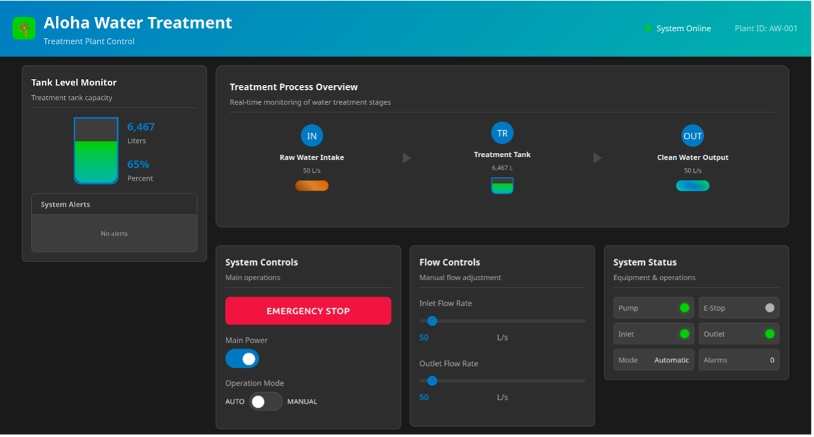

# Aloha Water Treatment Simulator

A simplified simulation of a water treatment plant with Modbus and BACnet process control.
Designed to serve as a target for MITRE Caldera for OT.



## Description

This simulator provides a Modbus and BACnet-enabled water treatment plant for testing and
training. It includes PLC servers and web-based HMIs, useful for practicing
protocol interactions without physical hardware.

## Getting Started

### Dependencies

* Python 3
* Flask, BAC0, pymodbus (see requirements.txt)

### Installation

1. Clone this repo:
```bash
git clone https://github.com/mitre/aloha-water-treatment.git
```

2. Install dependencies:
```bash
pip install -r requirements.txt
```

3. Run the simulator:
```bash
python run.py
```

## Usage

Follow the steps below to interact with the Aloha Water Treatment control
system using the web interface or protocol clients:

### Step 1: Start the Simulator
```bash
python run.py
```

Select your deployment mode from the menu:

**Modbus**
*   **Local**: Runs both PLC and HMI on the same system
    *   Prompts for port selection (502 or 5020, default 5020)
*   **Distributed**: Runs PLC or HMI separately on different systems
    *   For PLC: Prompts for bind IP address (default 0.0.0.0) and port (502 or 5020, default 5020)
    *   For HMI: Prompts for PLC IP address to connect to (default 127.0.0.1) and port (default 5020)
*   Note: Port 502 is the standard Modbus port but requires root/admin privileges
*   PLC listens on selected port, HMI runs on port 8090

**BACnet**
*   **Distributed**: Runs PLC or HMI separately (required for BACnet)
    *   For PLC: Prompts for PLC IP address (default 127.0.0.1, automatically adds /24)
    *   For HMI: Prompts for PLC IP address to connect to (default 127.0.0.1)
*   PLC uses BACnet device ID 1001, HMI runs on port 8090
*   Note: BACnet components must run on separate endpoints

## Modbus Register Map

The Modbus PLC exposes the following registers on port 5020:

### Coils (Read/Write)
| Address | Name               | Description                        |
|---------|--------------------|------------------------------------|
| 0       | emergencyStop      | Emergency stop button/status        |
| 1       | pumpSwitch         | Main pump switch/status             |
| 2       | pumpStatus         | Pump operational state              |
| 3       | inflowValve        | Inlet valve state/status            |
| 4       | outflowValve       | Outlet valve state/status           |
| 5       | inflowMode         | Auto/manual mode (0=Auto, 1=Manual) |
| 6       | overflowAlarm      | High level alarm                    |
| 7       | lowLevelAlarm      | Low level alarm                     |
| 8       | operatorErrorAlarm | Operator error/safety violation     |

### Holding Registers (Read/Write)
| Address | Name        | Description                    |
|---------|-------------|--------------------------------|
| 0       | tankLevel   | Treatment tank water level     |
| 1       | emergencyStop | Emergency stop button/status  |
| 2       | pumpSwitch  | Main pump switch/status        |
| 3       | pumpStatus  | Pump operational state         |
| 4       | inflowValve | Inlet valve state/status       |
| 5       | outflowValve| Outlet valve state/status      |
| 6       | inflowRate  | Inlet flow rate                |
| 7       | outflowRate | Outlet flow rate               |
| 8       | inflowMode  | Auto/manual mode (0=Auto, 1=Manual) |
| 9       | overflowAlarm | High level alarm              |

## BACnet Object List

The BACnet PLC exposes the following objects (Device ID 1001):

### Analog Values
| Instance | Name       | Description                |
|----------|------------|----------------------------|
| 1        | tankLevel  | Treatment tank water level |
| 2        | inflowRate | Inlet flow rate            |
| 3        | outflowRate| Outlet flow rate           |

### Binary Values
| Instance | Name         | Description                        |
|----------|--------------|------------------------------------|
| 1        | emergencyStop| Emergency stop button/status        |
| 2        | pumpSwitch   | Main pump switch/status             |
| 3        | inflowMode   | Auto/manual mode (0=Auto, 1=Manual) |

### Binary Outputs
| Instance | Name               | Description                        |
|----------|--------------------|------------------------------------|
| 1        | pumpStatus         | Pump operational state              |
| 2        | inflowValve        | Inlet valve state/status            |
| 3        | outflowValve       | Outlet valve state/status           |
| 4        | overflowAlarm      | High level alarm                    |
| 5        | lowLevelAlarm      | Low level alarm                     |
| 6        | operatorErrorAlarm | Operator error/safety violation     |
