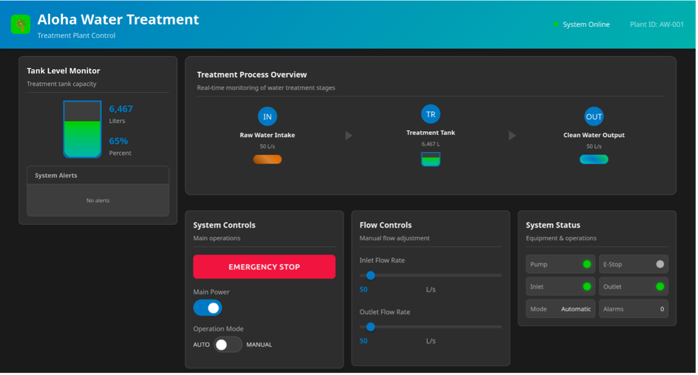

# Aloha Water Treatment Simulator

A simplified simulation of a water treatment plant with Modbus and BACnet process control.
Designed to serve as a target for Caldera for OT.



## Description

This simulator provides a Modbus and BACnet-enabled water treatment plant for testing and
training. It includes PLC servers and web-based HMIs, useful for practicing
protocol interactions without physical hardware.

## Getting Started
For a detailed walkthrough please read our medium article on Aloha!
https://medium.com/@mitrecaldera/caldera-for-ot-aloha-water-treatment-more-virtual-ot-sandboxes-080dc437da89

### Dependencies

* Python >= 3.14 (see `.python-version`)
* Flask, BAC0, pymodbus==3.11.4 (see requirements.txt)

### Installation

1. Clone this repo:
```bash
git clone https://github.com/mitre/aloha-water-treatment.git
```

2. Install dependencies:
```bash
pip install -r requirements.txt
```

3. Run the simulator:
```bash
python run.py
```

## Usage

Follow the steps below to interact with the Aloha Water Treatment control
system using the web interface or protocol clients:

### Step 1: Start the Simulator
```bash
python run.py
```

Select your deployment mode from the menu:

**Modbus**
*   **Local**: Runs both PLC and HMI on the same system
    *   Prompts for port selection (502 or 5020, default 5020)
*   **Distributed**: Runs PLC or HMI separately on different systems
    *   For PLC: Prompts for bind IP address (default 0.0.0.0) and port (502 or 5020, default 5020)
    *   For HMI: Prompts for PLC IP address to connect to (default 127.0.0.1) and port (default 5020)
*   Note: Port 502 is the standard Modbus port but requires root/admin privileges
*   PLC listens on selected port, HMI runs on port 8090

**BACnet**
*   **Distributed**: Runs PLC or HMI separately (required for BACnet)
    *   For PLC: Prompts for PLC IP address (default 127.0.0.1, automatically adds /24)
    *   For HMI: Prompts for PLC IP address to connect to (default 127.0.0.1)
*   PLC uses BACnet device ID 1001, HMI runs on port 8090
*   Note: BACnet components must run on separate endpoints

## Caldera OT Integration

This repo ships a fact source and adversary profiles for use with [Caldera for OT](https://github.com/mitre/caldera-ot) and its Modbus and BACnet plugins.

### Setup

The files below are templates - copy them into the matching Caldera plugin directory and adjust values for your environment:

| Template | Destination |
|---|---|
| `docs/sources/aloha-simulator-facts.yml` | `plugins/<protocol>/data/sources/` |
| `docs/adversaries/modbus-reconnaissance.yml` | `plugins/modbus/data/adversaries/` |
| `docs/adversaries/modbus-manual-overflow.yml` | `plugins/modbus/data/adversaries/` |
| `docs/adversaries/modbus-emergency-stop.yml` | `plugins/modbus/data/adversaries/` |
| `docs/adversaries/bacnet-reconnaissance.yml` | `plugins/bacnet/data/adversaries/` |
| `docs/adversaries/bacnet-manual-overflow.yml` | `plugins/bacnet/data/adversaries/` |
| `docs/adversaries/bacnet-emergency-stop.yml` | `plugins/bacnet/data/adversaries/` |

Restart Caldera after copying so it picks up the new files.

### Scenarios

Each scenario can be run through Modbus or BACnet. The scenario docs list the protocol-specific operation and facts to use. BACnet scenarios assume the BACnet PLC is reachable on the BACnet network.

| Adversary | Scenario | Description |
|---|---|---|
| Aloha Modbus/BACnet Reconnaissance | [Scenario 1](docs/scenarios/scenario_1_reconnaissance.md) | Read process values and control points without changing state |
| Aloha Modbus/BACnet Manual Overflow | [Scenario 2](docs/scenarios/scenario_2_manual_overflow.md) | Switch to manual control, set inflow higher than outflow, and watch for overflow |
| Aloha Modbus/BACnet Emergency Stop | [Scenario 3](docs/scenarios/scenario_3_emergency_stop.md) | Trigger emergency stop and verify the process shuts down |

## Modbus Register Map

The Modbus PLC exposes the following registers on port 5020:

### Coils (Read/Write)
| Address | Name | Description |
|---------|------|-------------|
| 0 | EmergencyStop | Emergency stop (1 = active) |
| 1 | PumpSwitch | Pump switch (1 = on) |
| 2 | PumpStatus | Pump status (1 = running) |
| 3 | InflowValve | Inflow valve (1 = open) |
| 4 | OutflowValve | Outflow valve (1 = open) |
| 5 | InflowMode | Mode select (0 = Auto, 1 = Manual) |
| 6 | OverflowAlarm | Overflow alarm (1 = active) |
| 7 | LowLevelAlarm | Low level alarm (1 = active) |
| 8 | OperatorErrorAlarm | Operator error (1 = active) |

### Holding Registers (Read/Write)
| Address | Name | Description |
|---------|------|-------------|
| 0 | TankLevel | Tank level (0-10000) |
| 1 | EmergencyStop | Emergency stop (1 = active) |
| 2 | PumpSwitch | Pump switch (1 = on) |
| 3 | PumpStatus | Pump status (1 = running) |
| 4 | InflowValve | Inflow valve (1 = open) |
| 5 | OutflowValve | Outflow valve (1 = open) |
| 6 | InflowRate | Inflow rate (L/s) |
| 7 | OutflowRate | Outflow rate (L/s) |
| 8 | InflowMode | Mode select (0 = Auto, 1 = Manual) |
| 9 | OverflowAlarm | Overflow alarm (1 = active) |

## BACnet Object List

The BACnet PLC exposes the following objects (Device ID 1001):

### Analog Values
| Instance | Name | Description |
|----------|------|-------------|
| 1 | TankLevel | Treatment tank water level |
| 2 | InflowRate | Inlet flow rate |
| 3 | OutflowRate | Outlet flow rate |

### Binary Values
| Instance | Name | Description |
|----------|------|-------------|
| 1 | EmergencyStop | Emergency stop button |
| 2 | PumpSwitch | Main pump switch |
| 3 | InflowMode | Inflow mode (False = Auto, True = Manual) |

### Binary Outputs
| Instance | Name | Description |
|----------|------|-------------|
| 1 | PumpStatus | Pump operational state |
| 2 | InflowValve | Inlet valve state |
| 3 | OutflowValve | Outlet valve state |
| 4 | OverflowAlarm | High level alarm |
| 5 | LowLevelAlarm | Low level alarm |
| 6 | OperatorErrorAlarm | Operator error / safety violation |
