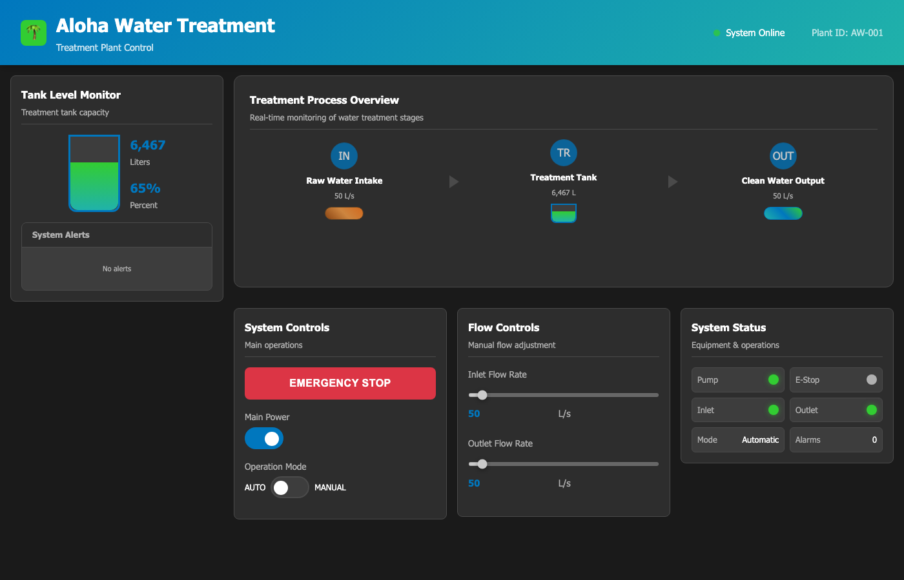

# Scenario 1: Reconnaissance

## Overview

| Field | Value |
|---|---|
| **Tactic** | Collection, Discovery |
| **Techniques** | [T0802 - Automated Collection](https://attack.mitre.org/techniques/T0802/), [T0846 - Remote System Discovery](https://attack.mitre.org/techniques/T0846/), [T0861 - Point & Tag Identification](https://attack.mitre.org/techniques/T0861/) |
| **Target** | Aloha PLC over Modbus or BACnet |
| **Impact** | None - read-only operations only |

## Objective

Read Aloha process values and control points without issuing control commands.
This gives a baseline view of tank level, pump state, valve state, alarm state,
flow values, and control objects exposed by the PLC.

## Modbus Variant

Load `docs/sources/aloha-simulator-facts.yml` as the fact source, then
build an operation using the Modbus abilities below.

### Fact Variables

| Fact | Description | Type | Default |
|------|-------------|------|---------|
| `modbus.server.ip` | IP address of the Modbus PLC | string | `127.0.0.1` |
| `modbus.server.port` | TCP port for the Modbus PLC | int | `5020` |
| `modbus.read_coil.start` | First coil to read | int | `0` |
| `modbus.read_coil.count` | Number of coils to read | int | `9` |
| `modbus.read_holding.start` | First holding register to read | int | `0` |
| `modbus.read_holding.count` | Number of holding registers to read | int | `10` |

### Caldera Operation

| Step | Ability | Ability ID | Facts Used |
|------|---------|------------|------------|
| 1 | Modbus - Read Coils | `d80b9cd5-b1d8-482a-a745-71d74f9d0885` | `modbus.server.ip`, `modbus.server.port`, `modbus.read_coil.start`, `modbus.read_coil.count` |
| 2 | Modbus - Read Holding Registers | `bc8961a2-7534-4b2a-bbc3-2456f58243be` | `modbus.server.ip`, `modbus.server.port`, `modbus.read_holding.start`, `modbus.read_holding.count` |

## BACnet Variant

Load `docs/sources/aloha-simulator-facts.yml` as the fact source, then
build an operation using the BACnet abilities below.

### Fact Variables

| Fact | Description | Type | Default |
|------|-------------|------|---------|
| `bacnet.device.instance` | Aloha BACnet device instance | int | `1001` |
| `bacnet.obj.type` | BACnet object type for direct reads | string | `device` |
| `bacnet.obj.instance` | BACnet object instance for direct reads | int | `1001` |
| `bacnet.obj.property` | BACnet property to read | int or string | `76` |
| `bacnet.read.index` | BACnet array read index | int | `-2` |
| `bacnet.object.type` | Object type for object collection | string | `analog-value` |
| `bacnet.object.instance` | Object instance for object collection | int | `1` |

### Caldera Operation

| Step | Ability | Ability ID | Facts Used |
|------|---------|------------|------------|
| 1 | BACnet Who-Is | `b93bd80e-3a70-11eb-adc1-0242ac120002` | Discover device instance `1001` |
| 2 | BACnet Device Collection - Basic | `485e97e7-c352-432d-b8d3-fa8460e4fe49` | `bacnet.device.instance` |
| 3 | BACnet Read Property | `47432648-5678-11eb-ae93-0242ac130002` | `bacnet.device.instance`, `bacnet.obj.type`, `bacnet.obj.instance`, `bacnet.obj.property`, `bacnet.read.index` |
| 4 | BACnet Object Collection - Basic | `bd13ac81-b932-463d-95aa-a22aeefbc9ac` | `bacnet.device.instance`, `bacnet.object.type`, `bacnet.object.instance` |

## Expected Observations

- Modbus coils show emergency stop, pump switch, pump status, valve, mode, and alarm states.
- Modbus holding registers show tank level, flow rates, mode, and overflow alarm.
- BACnet discovery should return the Aloha device instance.
- BACnet object collection should show analog values, binary values, and binary outputs from the README object list.
- No process state should change because the scenario only reads values.

## See Also

- [MITRE Caldera for OT](https://github.com/mitre/caldera-ot)
- [ATT&CK for ICS - T0802](https://attack.mitre.org/techniques/T0802/)
- [ATT&CK for ICS - T0846](https://attack.mitre.org/techniques/T0846/)
- [ATT&CK for ICS - T0861](https://attack.mitre.org/techniques/T0861/)
