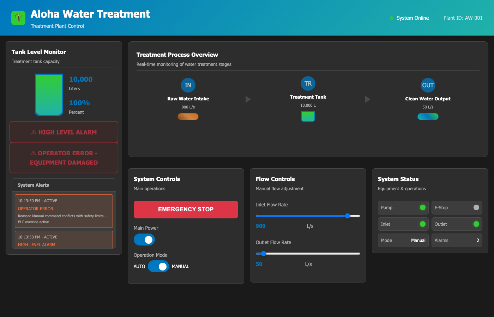

# Scenario 2: Manual Overflow

## Overview

| Field | Value |
|---|---|
| **Tactic** | Impair Process Control, Impact |
| **Techniques** | [T0855 - Unauthorized Command Message](https://attack.mitre.org/techniques/T0855/), [T0831 - Manipulation of Control](https://attack.mitre.org/techniques/T0831/), [T0826 - Loss of Availability](https://attack.mitre.org/techniques/T0826/) |
| **Target** | Aloha PLC over Modbus or BACnet |
| **Impact** | Tank level rises toward overflow and alarm state becomes visible in the HMI |

## Objective

Switch the simulator into manual mode, set inflow higher than outflow, and
observe the process impact. In automatic mode the simulator tries to keep the
tank around its target level. Manual writes let an operator or adversary set
unsafe flow values and watch the tank move toward an alarm condition.

## Modbus Variant

Load `docs/sources/aloha-simulator-facts.yml` as the fact source, then
build an operation using the Modbus abilities below.

### Fact Variables

| Fact | Description | Type | Default |
|------|-------------|------|---------|
| `modbus.server.ip` | IP address of the Modbus PLC | string | `127.0.0.1` |
| `modbus.server.port` | TCP port for the Modbus PLC | int | `5020` |
| `modbus.write_coil.start` | Coil to write | int | `1` for PumpSwitch, `5` for manual mode |
| `modbus.write_coil.value` | Coil value to write | int | `1` |
| `modbus.write_register.start` | Holding register to write | int | `6` for InflowRate, `7` for OutflowRate |
| `modbus.write_register.value` | Holding register value | int | `900` for InflowRate, `50` for OutflowRate |

Control data:

| Control | Modbus Address | Value |
|---|---:|---|
| PumpSwitch | Coil `1` | `1` |
| InflowMode / Manual mode | Coil `5` | `1` |
| InflowRate | Holding register `6` | `900` |
| OutflowRate | Holding register `7` | `50` |

### Caldera Operation

| Step | Ability | Ability ID | Facts Used |
|------|---------|------------|------------|
| 1 | Modbus - Read Coils | `d80b9cd5-b1d8-482a-a745-71d74f9d0885` | Baseline coil state |
| 2 | Modbus - Write Single Coil | `056e6289-4cbf-417f-928a-d75125e4db4f` | `start=1`, `value=1` |
| 3 | Modbus - Write Single Coil | `056e6289-4cbf-417f-928a-d75125e4db4f` | `start=5`, `value=1` |
| 4 | Modbus - Write Single Register | `d6991b6b-d3b2-4398-ad3f-d736ae09acf9` | `start=6`, `value=900` |
| 5 | Modbus - Write Single Register | `d6991b6b-d3b2-4398-ad3f-d736ae09acf9` | `start=7`, `value=50` |
| 6 | Modbus - Read Holding Registers | `bc8961a2-7534-4b2a-bbc3-2456f58243be` | Verify tank and flow values |
| 7 | Modbus - Read Coils | `d80b9cd5-b1d8-482a-a745-71d74f9d0885` | Verify mode and alarm state |

## BACnet Variant

Load `docs/sources/aloha-simulator-facts.yml` as the fact source, then
build an operation using the BACnet abilities below.

### Fact Variables

| Fact | Description | Type | Default |
|------|-------------|------|---------|
| `bacnet.device.instance` | Aloha BACnet device instance | int | `1001` |
| `bacnet.obj.type` | BACnet object type to write | string | `binary-value` or `analog-value` |
| `bacnet.obj.instance` | BACnet object instance to write | int | `2`, `3`, `2`, or `3` depending on the step |
| `bacnet.obj.property` | BACnet property to write | int or string | `present-value` |
| `bacnet.write.priority` | BACnet write priority | int | `5` |
| `bacnet.write.index` | BACnet write index | int | `-1` |
| `bacnet.write.tag` | BACnet application tag | int | `9` for binary values, `4` for real values |
| `bacnet.write.value` | Value to write | int | `1`, `900`, or `50` |

Control data:

| Control | BACnet Object | Value |
|---|---|---|
| PumpSwitch | `binary-value 2 present-value` | active |
| ManualMode | `binary-value 3 present-value` | active |
| InflowRate | `analog-value 2 present-value` | `900` |
| OutflowRate | `analog-value 3 present-value` | `50` |

### Caldera Operation

| Step | Ability | Ability ID | Facts Used |
|------|---------|------------|------------|
| 1 | BACnet Object Collection - Basic | `bd13ac81-b932-463d-95aa-a22aeefbc9ac` | Baseline object state |
| 2 | BACnet Write Property | `1a2faf5a-4601-11eb-b378-0242ac130002` | `binary-value 2 present-value`, `tag=9`, `value=1` |
| 3 | BACnet Write Property | `1a2faf5a-4601-11eb-b378-0242ac130002` | `binary-value 3 present-value`, `tag=9`, `value=1` |
| 4 | BACnet Write Property | `1a2faf5a-4601-11eb-b378-0242ac130002` | `analog-value 2 present-value`, `tag=4`, `value=900` |
| 5 | BACnet Write Property | `1a2faf5a-4601-11eb-b378-0242ac130002` | `analog-value 3 present-value`, `tag=4`, `value=50` |
| 6 | BACnet Object Collection - Basic | `bd13ac81-b932-463d-95aa-a22aeefbc9ac` | Verify tank, flow, and alarm state |

## Expected Observations

- Pump switch and manual mode become active.
- Inflow is higher than outflow, so tank level rises.
- If the tank reaches maximum level, the overflow alarm becomes visible in the HMI.
- Reads after the writes should show changed flow values and alarm/status state.

## See Also

- [MITRE Caldera for OT](https://github.com/mitre/caldera-ot)
- [ATT&CK for ICS - T0855](https://attack.mitre.org/techniques/T0855/)
- [ATT&CK for ICS - T0831](https://attack.mitre.org/techniques/T0831/)
- [ATT&CK for ICS - T0826](https://attack.mitre.org/techniques/T0826/)
