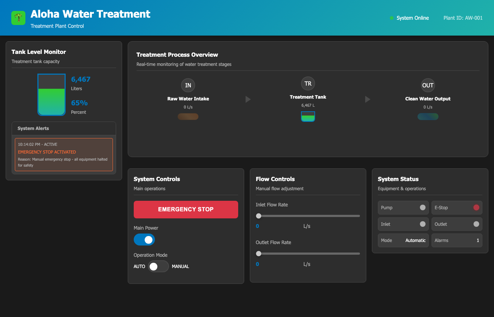

# Scenario 3: Emergency Stop

## Overview

| Field | Value |
|---|---|
| **Tactic** | Inhibit Response Function, Impair Process Control |
| **Techniques** | [T0803 - Block Command Message](https://attack.mitre.org/techniques/T0803/), [T0831 - Manipulation of Control](https://attack.mitre.org/techniques/T0831/) |
| **Target** | Aloha PLC over Modbus or BACnet |
| **Impact** | Emergency stop inhibits the pump and stops active process movement |

## Objective

Set emergency stop through the selected OT protocol and verify that the HMI
shows the process halted. For the clearest visual change, run this after the
pump is already active.

## Modbus Variant

Load `docs/sources/aloha-simulator-facts.yml` as the fact source, then
build an operation using the Modbus abilities below.

### Fact Variables

| Fact | Description | Type | Default |
|------|-------------|------|---------|
| `modbus.server.ip` | IP address of the Modbus PLC | string | `127.0.0.1` |
| `modbus.server.port` | TCP port for the Modbus PLC | int | `5020` |
| `modbus.write_coil.start` | Coil to write | int | `0` |
| `modbus.write_coil.value` | Coil value to write | int | `1` |

Control data:

| Control | Modbus Address | Value |
|---|---:|---|
| EmergencyStop | Coil `0` | `1` |

### Caldera Operation

| Step | Ability | Ability ID | Facts Used |
|------|---------|------------|------------|
| 1 | Modbus - Read Coils | `d80b9cd5-b1d8-482a-a745-71d74f9d0885` | Baseline coil state |
| 2 | Modbus - Write Single Coil | `056e6289-4cbf-417f-928a-d75125e4db4f` | `start=0`, `value=1` |
| 3 | Modbus - Read Coils | `d80b9cd5-b1d8-482a-a745-71d74f9d0885` | Verify emergency stop state |
| 4 | Modbus - Read Holding Registers | `bc8961a2-7534-4b2a-bbc3-2456f58243be` | Verify flow values |

## BACnet Variant

Load `docs/sources/aloha-simulator-facts.yml` as the fact source, then
build an operation using the BACnet abilities below.

### Fact Variables

| Fact | Description | Type | Default |
|------|-------------|------|---------|
| `bacnet.device.instance` | Aloha BACnet device instance | int | `1001` |
| `bacnet.obj.type` | BACnet object type to write | string | `binary-value` |
| `bacnet.obj.instance` | BACnet object instance to write | int | `1` |
| `bacnet.obj.property` | BACnet property to write | int or string | `present-value` |
| `bacnet.write.priority` | BACnet write priority | int | `5` |
| `bacnet.write.index` | BACnet write index | int | `-1` |
| `bacnet.write.tag` | BACnet application tag | int | `9` |
| `bacnet.write.value` | Value to write | int | `1` |

Control data:

| Control | BACnet Object | Value |
|---|---|---|
| EmergencyStop | `binary-value 1 present-value` | active |

### Caldera Operation

| Step | Ability | Ability ID | Facts Used |
|------|---------|------------|------------|
| 1 | BACnet Object Collection - Basic | `bd13ac81-b932-463d-95aa-a22aeefbc9ac` | Baseline object state |
| 2 | BACnet Write Property | `1a2faf5a-4601-11eb-b378-0242ac130002` | `binary-value 1 present-value`, `tag=9`, `value=1` |
| 3 | BACnet Object Collection - Basic | `bd13ac81-b932-463d-95aa-a22aeefbc9ac` | Verify emergency stop and pump state |

## Expected Observations

- Emergency stop becomes active.
- PumpStatus becomes inactive after the PLC simulation loop updates.
- InflowRate and OutflowRate fall to `0` while emergency stop is active.
- The pump switch can remain active, but emergency stop prevents the process from running.

## See Also

- [Caldera for OT](https://github.com/mitre/caldera-ot)
- [ATT&CK for ICS - T0803](https://attack.mitre.org/techniques/T0803/)
- [ATT&CK for ICS - T0831](https://attack.mitre.org/techniques/T0831/)
